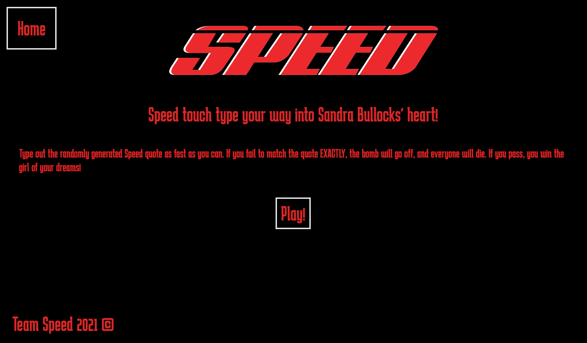
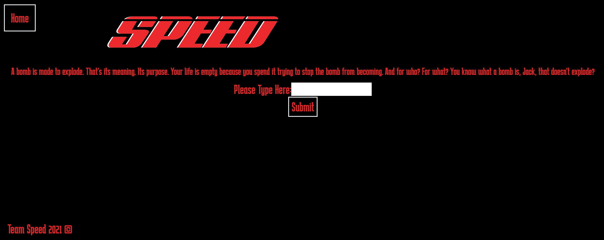
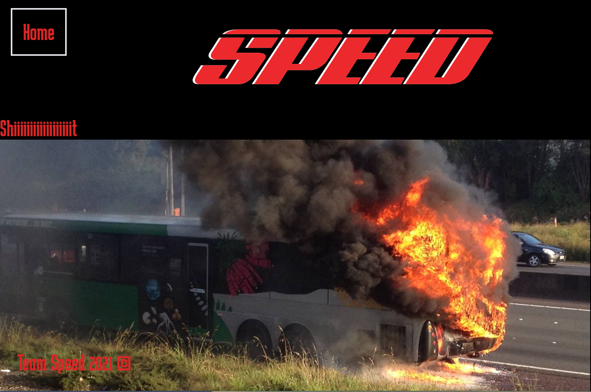

# Speed

Type the displayed quote from the 'Speed' movie in the given time frame or EXPLODE!

This is a one day group project that we've done at Dev Academy.

### From the command line

```bash
npm install # to install dependencies
npm run knex migrate:latest # to reset database
npm run knex seed:run # to get seed data
npm run dev # to start the dev server
```

You can find the server running on [http://localhost:3000](http://localhost:3000).

## User Interface

Home Page
------------------------------------


Game Page
------------------------------------


Result Page
------------------------------------


## Tech Stack
**Client:** React, TailwindCSS

**Server:** Node, Express, Knex

**Testing:** Jest

## Authors
- Sina Kakhki - [@sina-kakhki](https://github.com/sina-kakhki)

- Erin L Abernethy -[@ErinLlouise](https://github.com/ErinLlouise)

- Jonathan Zhou - [@jonathan-zhou](https://github.com/jonathan-zhou)

- Jared Pinfold - [@jared-pinfold](https://github.com/jared-pinfold)
